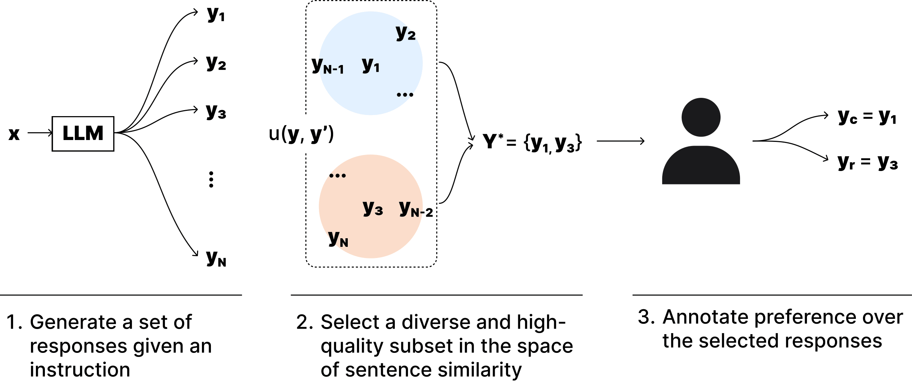

## Annotation-Efficient Preference Optimization



This repository implements the [Annotation-Efficient Preference Optimization (AEPO) algorithm](https://arxiv.org/abs/2405.13541).

The code is tested on Ubuntu 20.04 using Python 3.9 and CUDA 11.0 (Docker image nvidia/cuda:11.0.3-cudnn8-devel-ubuntu20.04).

## Install

You can install aepo via pip.
```
pip install aepo
```

Source install is available too. Clone this repository and run `pip install .`.
```
git clone git@github.com:CyberAgentAILab/annotation-efficient-po.git
cd annotation-efficient-po
pip install .
```


## Usage

The command line interface is available.
The input dataset can be csv file or a dataset uploaded to Huggingface Hub.
The dataset should have a column named *prompt* or *instruction*. aepo recognize it as the user prompt given to the system and the rest of the columns to be the responses generated by the system.

I prepared an example dataset in `dataset/alpaca_samples.csv`.
The csv file includes 128 responses generated by [HuggingFaceH4/mistral-7b-sft-beta](https://huggingface.co/HuggingFaceH4/mistral-7b-sft-beta) for each instruction of the `alpaca_human_preference` split of [tatsu-lab/alpaca_farm](https://huggingface.co/datasets/tatsu-lab/alpaca_eval).
You can try aepo using this dataset with the following command:

```
aepo dataset/alpaca_samples.csv --num_responses 8 --num_annotations 2 --num_instructions 10
```

`--num_responses` is the number of input responses you use. The dataset has to have responses larger than or equal to `--num_responses`. `--num_annotations` is the number of responses after the subsampling process. It is also the number of times the reward model is queried per instruction.

### Example: Running AEPO

You can generate a pair of responses for each instruction using aepo using the following command.

```
aepo dataset/alpaca_samples.csv --num_responses 8 --num_annotations 2 --num_instructions 10
```

To subsample four responses for e.g., [LiPO](https://arxiv.org/abs/2402.01878v1), set `--num_annotations` to four.

```
aepo dataset/alpaca_samples.csv --num_responses 8 --num_annotations 4 --num_instructions 10
```

### Example: Running West-of-N over 8 samples
[West-of-N](https://arxiv.org/abs/2401.12086) is a strategy to pick the Best-of-N as the chosen response, and Worst-of-N as a rejected response. It is shown to be effective for DPO and reward modeling.
You can run West-of-N using this package by setting `--num_annotations` == `--num_responses`.

```
aepo dataset/alpaca_samples.csv --num_responses 8 --num_annotations 8 --num_instructions 10
```

This command will generate a dataset with 8 responses, ranked by their rewards. If you only need the best and worst of the N samples, then use `--west_of_n` option.

```
aepo dataset/alpaca_samples.csv --num_responses 8 --num_annotations 8 --num_instructions 10 --west_of_n
```

This will pick the best and worst responses as the chosen and rejected. The rest of the responses are discarded.
It would be useful to construct a pairwise preference dataset.

## Reference

[Jinnai, Y., Honda, U. (2024). Annotation-Efficient Preference Optimization for Language Model Alignment. arXiv preprint arXiv:2405.13541.](https://arxiv.org/abs/2405.13541)


Bibtex:

```
@misc{jinnai2024annotationefficient,
      title={Annotation-Efficient Preference Optimization for Language Model Alignment}, 
      author={Yuu Jinnai and Ukyo Honda},
      year={2024},
      eprint={2405.13541},
      archivePrefix={arXiv},
      primaryClass={cs.CL}
}
```

## Contact
For any questions, feel free to raise an issue or contact me at jinnai_yu@cyberagent.co.jp.

## Acknowledgements
[AlpacaFarm dataset](https://github.com/tatsu-lab/alpaca_farm) is licensed under [Attribution-NonCommercial 4.0 International](https://github.com/tatsu-lab/alpaca_farm/blob/main/DATA_LICENSE).
